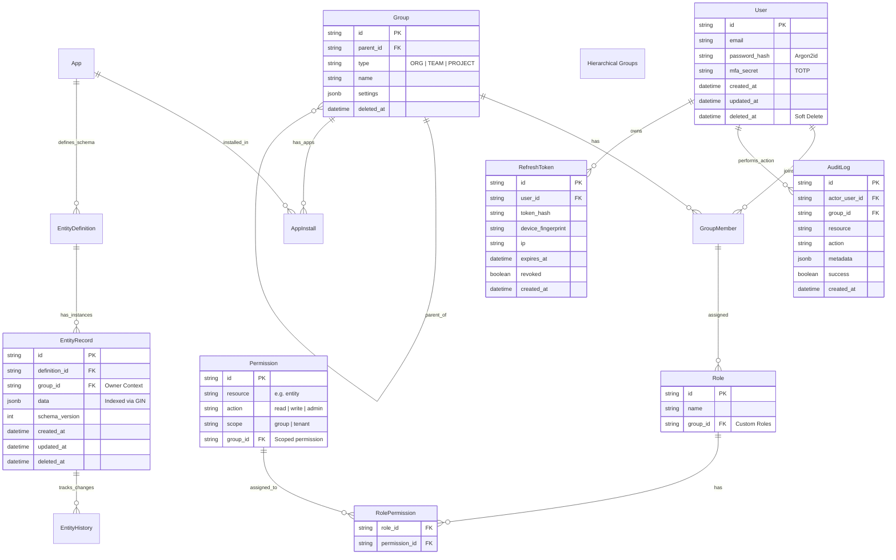

# FlexiSuite Kernel System Specification v3.1 (Final)

## 1. System Overview
**FlexiSuite Kernel** is the operating system for the FlexiSuite SaaS ecosystem. It provides the fundamental primitives (Identity, Data, Events) and manages the lifecycle of Apps and Components.

### Core Philosophy
- **Kernel as OS**: Manages resources, processes (Apps), and permissions.
- **SaaS First**: Multi-tenant architecture with strict logical isolation and RLS enforcement.
- **Extensibility**: "Custom UX" via dynamic loading of user-defined components.
- **Universal Abstraction**: "Everything is an Entity" managed by the Kernel.

### Multitenancy & Security Guardrails
- **Tenant scope first-class**: Every DB access includes `groupId/tenantId`; Postgres Row Level Security (RLS) is enabled on shared tables using `current_setting('flexi.current_group')`.
- **Auth hardening**: Argon2id passwords, MFA (TOTP), short-lived JWT access tokens, rotating refresh tokens with reuse detection, and revocation lists in Redis.
- **Rate limits**: Per-IP and per-user rate limits on auth and write-heavy endpoints.
- **Auditability**: All security-sensitive actions emit `AuditLog` entries with actor, target, resource, result, and correlation ID.

## 2. Architecture & Tech Stack
- **Runtime**: Node.js (TypeScript)
- **Database**: PostgreSQL (Prisma ORM)
- **Cache/Queue**: Redis (Required for Sessions & Events)
- **Architecture**: Modular Monolith (Event-Driven)
- **Infrastructure**: VPS (Ubuntu) + PM2 + Nginx (Reverse Proxy/SSL)

## 3. Data Model (ER Diagram)

## 4. Core Modules Specification

### 4.1. IAM (Identity & Access Management)
- **Authentication**:
    - **Password**: Argon2id (min 12 chars).
    - **Session**:
        - **Access Token (JWT)**: Exp 15 min. Payload: `{ userId, groupId, roles }`. Signed, versioned.
        - **Refresh Token**: Exp 7 days. HttpOnly + Secure + SameSite=Strict. Stored in Redis/DB with Family ID for **Rotation & Reuse Detection**.
        - **CSRF**: Use double-submit or anti-CSRF token for cookie-based refresh endpoints.
    - **MFA**: TOTP required for Admin actions.
- **Authorization**:
    - **RBAC**: `RolePermission` junction table.
    - **Wildcards**: Supports `entity:*:read`. Permissions are scoped per `group_id`.
- **Isolation**:
    - **Enforcement**: **Prisma Middleware** injects `where: { groupId }` AND Postgres RLS is enabled on multi-tenant tables via `current_setting('flexi.current_group')`.
    - **Audit**: Auth, RBAC, and destructive actions log to `AuditLog` with correlation IDs.

### 4.2. Data Engine (The "File System")
- **Schema Evolution**:
    - **Default Strategy**: **Lazy Migration**. When reading an `EntityRecord` with old `schema_version`, the Kernel transforms it to the new format on-the-fly (and updates DB on write).
    - **Offline Backfill**: Optional batch job to re-save all records to latest schema for hot paths.
    - **Compatibility Tests**: Each schema version ships with fixtures + contract tests to ensure readability across N-1 versions.
- **Audit**:
    - `AuditLog` table tracks all write operations to `User`, `Group`, `Permission`, `EntityDefinition`, and `EntityRecord` (create/update/delete).

### 4.3. Event Bus (The Nervous System)
- **Mechanism**:
    - **Reliability**: **BullMQ** (Redis) for all system events.
    - **Delivery**: **At-least-once**. Consumers must be idempotent.
    - **Idempotency**: Events carry a unique `eventId`.
    - **Retries/DLQ**: Exponential backoff with max retries; failures land in a Dead-Letter Queue for replay.
    - **Ordering**: Per-entity streams to maintain order where required.
- **Schema**: Zod-validated payloads.

### 4.4. Runtime & Registry
- **Sandbox Manager**:
    - **Tech**: `isolated-vm`.
    - **API Surface**: Minimal `kernel` object exposed to sandbox (`kernel.data.get`, `kernel.data.save`).
    - **Limits**: 128MB RAM, 500ms CPU. No outbound network by default; module allowlist; temp FS only.
    - **Secrets Hygiene**: Env vars are not injected; runtime scrubs secrets from error logs.

## 5. Operational Readiness
- **Config**: `.env` file validated by Zod.
- **Observability**:
    - **Logs**: Pino (JSON).
    - **Metrics**: Prometheus endpoint (Req/sec, Latency, Error Rate).
    - **Health**: `/health` checks DB and Redis ping.
- **Security Headers**: Helmet (CSP, HSTS).
- **Rate Limit**: 100 req/min per user.
- **TLS**: Nginx terminates TLS (Let’s Encrypt/ACME). HSTS enabled.
- **Secrets**: App reads from env/secret store; never logged; rotation supported via restart.
- **Backups**: `pg_dump` encrypted (age/GPG) with 7/30/90 day retention; monthly restore drill.
- **Alerts/SLOs**: p95 latency, error rate, queue lag, DB/Redis availability with paging policy.

## 6. Directory Structure
(Same as v3.0)
