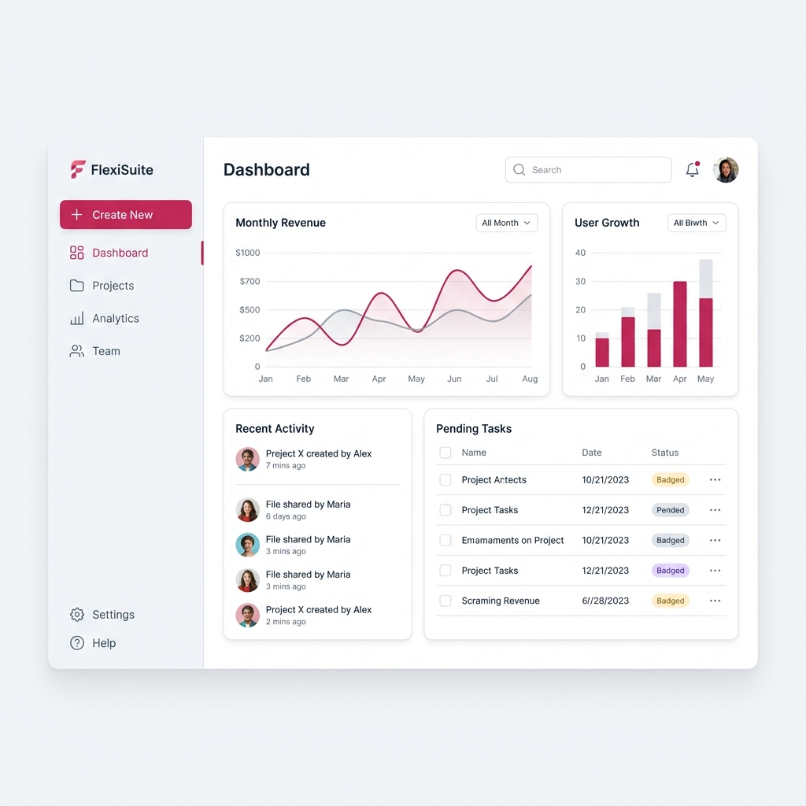
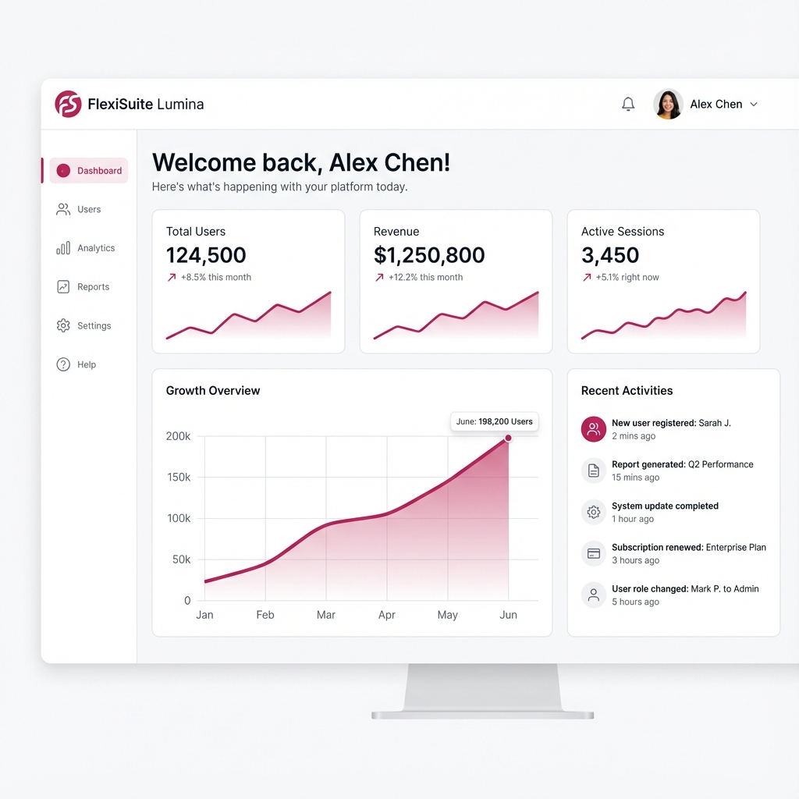
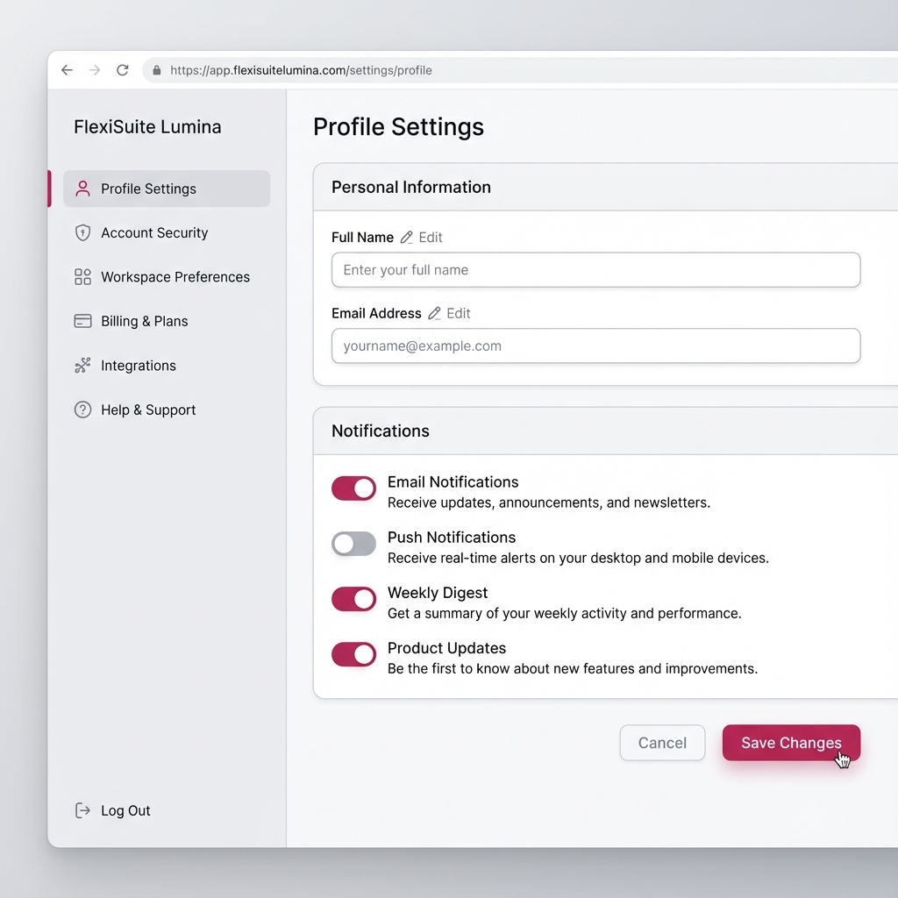
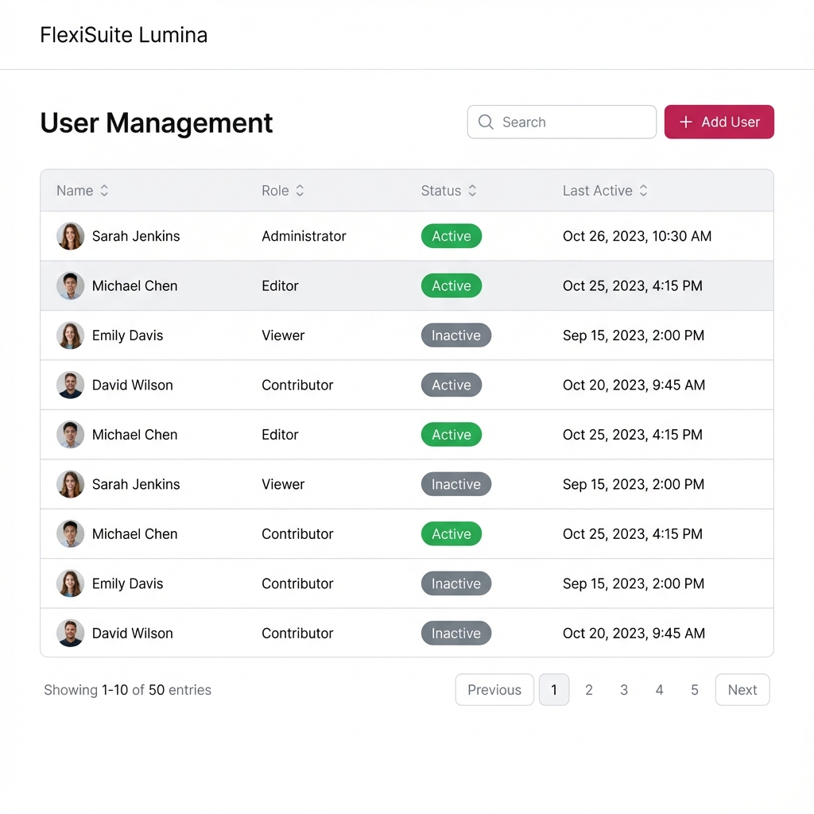
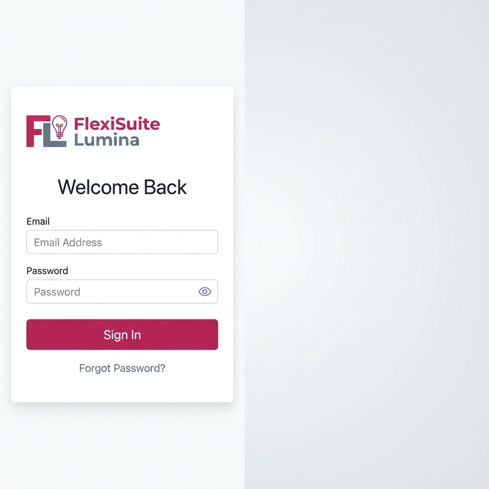

# Design System: FlexiSuite "Lumina"

## 1. Core Philosophy
**"Clarity, Freshness, and Human Warmth"**
The design aims for a pristine, distraction-free environment that feels modern and efficient but retains a touch of human warmth through the vibrant accent color. It should feel like a well-organized, sunlit workspace.

## 2. Color Palette

### Primary Accent
- **Raspberry Pink**: `#c2255d`
  - *Usage*: Primary buttons, active states, key highlights, brand elements.
  - *Vibe*: Energetic, confident, distinct.

### Neutral / Backgrounds (Light Theme)
- **Surface Base**: `#ffffff` (Pure White) - Main background.
- **Surface Alt**: `#f8f9fa` (Off-white/Light Gray) - Sidebar, cards, secondary areas.
- **Border**: `#e2e8f0` (Cool Gray) - Subtle dividers.

### Text
- **Primary Text**: `#1e293b` (Slate 800) - High contrast for readability, softer than pure black.
- **Secondary Text**: `#64748b` (Slate 500) - Metadata, hints, descriptions.

## 3. Typography
**Font Family**: `Inter` or `Roboto` (Modern Sans-Serif)

- **Headings**: Bold, tight tracking.
- **Body**: Regular weight, comfortable line height (1.5).
- **Labels**: Medium weight, slightly smaller.

## 4. UI Components

### Buttons
- **Primary**: Solid `#c2255d` background, white text. Rounded corners (e.g., 8px or 12px). Subtle shadow on hover.
- **Secondary**: Transparent background, `#c2255d` border and text.
- **Ghost**: Transparent background, dark gray text, hover effect.

### Cards & Containers
- **Style**: White background, subtle border (`#e2e8f0`), soft drop shadow (`0 4px 6px -1px rgba(0, 0, 0, 0.05)`).
- **Radius**: Generous rounding (12px - 16px) to feel friendly.

### Layout & Spacing
- **Whitespace**: Generous. Use whitespace to group related elements rather than heavy borders.
- **Grid**: 8pt grid system.

## 5. Visual Style
- **Iconography**: Thin stroke, rounded edges (e.g., Lucide, Heroicons).
- **Imagery**: Clean, high-key photography or abstract geometric shapes with soft gradients.

## 6. Component Gallery

### Detailed Dashboard

### Settings Page

### Data Table

### Login Screen

